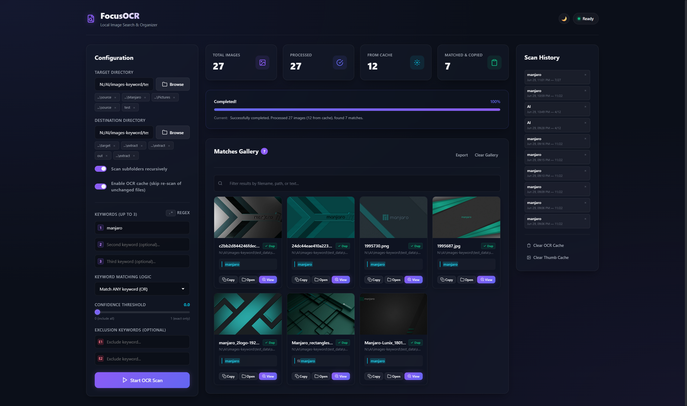

# FocusOCR — Local Image Search & Organizer

FocusOCR is a lightweight, fully offline desktop web app that scans images for text, matches keywords (plain or regex), and auto-organizes results into keyword-named folders. Chinese + English OCR powered by RapidOCR (PP-OCRv4).



---

## Key Features

- **100% Offline** — no external APIs, no CDN fonts, no uploads
- **Chinese & English OCR** — RapidOCR with PP-OCRv4 via ONNX Runtime
- **Regex & Exclusion Keywords** — toggle `.*` mode for regex patterns; exclude keywords reject unwanted matches
- **ANY / AND matching** — OR logic copies to per-keyword folders; AND logic creates a single combined folder
- **Auto-organized output** — matched images are copied into `dest/<keyword>/` folders with conflict resolution
- **Thumbnail gallery** — cached WebP thumbnails, lightbox preview, highlighted OCR snippets
- **Export CSV / JSON** — download match results with one click
- **Scan history** — last 10 scans saved in browser; click to restore parameters and gallery
- **Folder history** — recent target/dest directories remembered per-field
- **Real-time SSE progress** — live progress bar, current file display, per-card cache badge
- **Cancel scan** — server-side cancellation stops OCR immediately
- **GPU acceleration (DirectML)** — auto-detects GPU on Windows; install `onnxruntime-directml` to enable
- **Duplicate detection** — files already in destination are reused and marked with a "Dup" badge
- **Toast notifications** — auto-dismissing toasts replace alert() for non-blocking feedback
- **OCR result caching** — `~/.focusocr/ocr_cache/` avoids re-scanning unchanged files; configurable toggle in UI
- **Confidence filter** — slider (0–1) excludes low-quality OCR text from matching
- **Search within results** — client-side text filter on gallery cards
- **Light / Dark theme** — toggle button, persisted in localStorage
- **Keyboard shortcuts** — `Ctrl+Enter` to start, `Ctrl+Shift+E` to export, `Esc` to close
- **Open in Explorer** — reveal files in Windows Explorer from any result card
- **Native folder browser** — Tkinter directory dialog (reliable on Windows)

---

## Project Structure

```
main.py                          Entry point — starts server and launches browser
backend/
  app.py                         FastAPI server, SSE streaming, all API endpoints
  ocr_engine.py                  RapidOCR engine, keyword matching, cache logic
  config.py                      Settings dataclass, JSON file persistence
  folder_picker.py               Thread-safe Tkinter folder dialog
frontend/
  index.html                     Dashboard layout (3-column: config | results | history)
  style.css                      Dark + light glassmorphic theme, system font stack
  app.js                         All client logic: SSE, gallery, history, export, theme
  favicon.svg / favicon.ico       Tab icon
assets/
  icon.ico                       Multi-size .ico for the exe
dist/
  FocusOCR.exe                   Standalone executable (no Python needed)
```

---

## Standalone Executable

1. Navigate to `dist/` and double-click **FocusOCR.exe**
2. A terminal opens with server logs, your browser loads the dashboard
3. Close the terminal or press `Ctrl+C` to stop

*First run downloads PP-OCRv4 models (~30MB) to `~/.rapidocr/`; subsequent runs are fully offline.*

---

## Developer Setup

### Prerequisites
```bash
pip install fastapi uvicorn Pillow rapidocr_onnxruntime pyinstaller
# For GPU acceleration (Windows, any GPU):
pip uninstall onnxruntime
pip install onnxruntime-directml
```

### Run from source
```bash
python main.py
```
Server starts on port **9000** (falls back to 9001, 9002...).

### Rebuild exe
```bash
pyinstaller --clean FocusOCR.spec
```

---

## Configuration

Settings stored in `~/.focusocr/config.json`:

```json
{
  "host": "127.0.0.1",
  "start_port": 9000,
  "ocr_confidence_threshold": 0.0,
  "max_snippets_per_match": 3,
  "max_history_per_dir": 5,
  "enable_ocr_cache": true
}
```

| Setting | Default | Description |
|---|---|---|
| `host` | `"127.0.0.1"` | Bind address |
| `start_port` | `9000` | First port to try |
| `ocr_confidence_threshold` | `0.0` | Minimum confidence (0–1) to include text |
| `max_snippets_per_match` | `3` | Snippets shown per match in gallery |
| `max_history_per_dir` | `5` | Recent directories remembered |
| `enable_ocr_cache` | `true` | Skip re-scan of unchanged files |

The cache toggle and confidence slider are also available directly in the UI.

---

## Tech Stack

- **Backend**: FastAPI + Uvicorn (Python)
- **OCR**: RapidOCR ONNX Runtime (PP-OCRv4)
- **Images**: Pillow
- **Dialog**: Tkinter
- **Frontend**: Vanilla HTML5, ES6+, CSS3
- **Packaging**: PyInstaller
